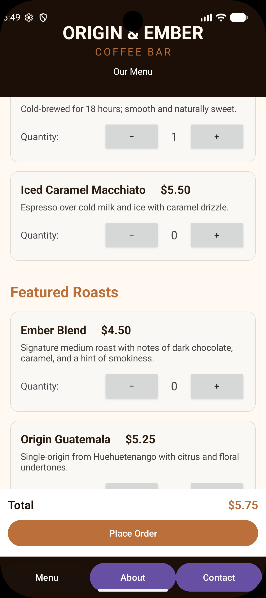
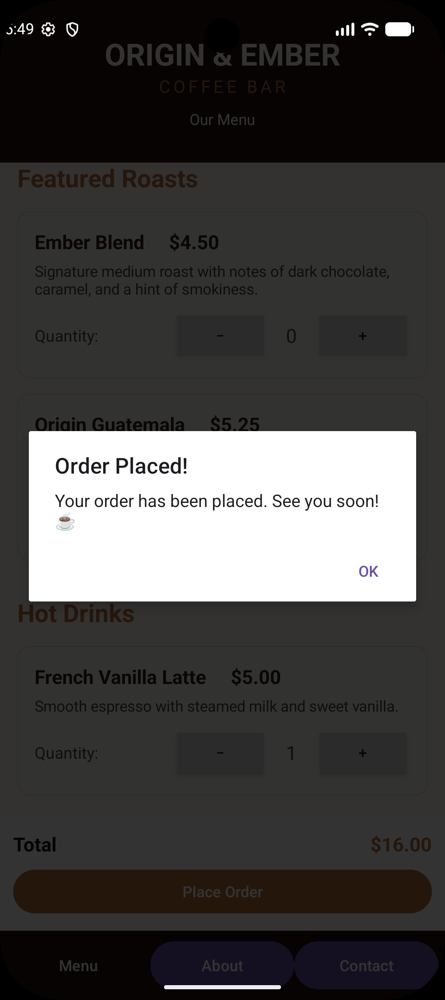
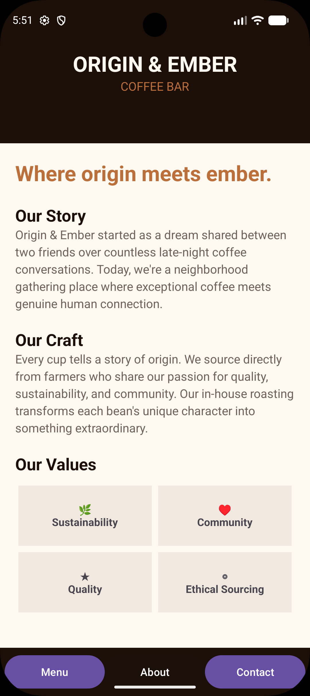
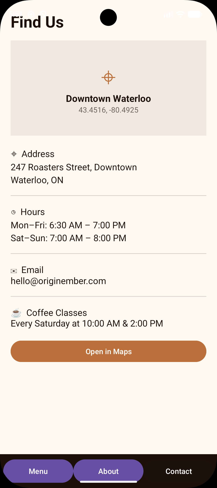

# Origin & Ember Coffee Bar — AndroidApp2

Origin & Ember Coffee Bar is an Android application developed in **Kotlin** using **Android Studio** and traditional **XML Views**. The project recreates the core functionality of the Origin & Ember coffee shop experience for Android.

## About the Project

The app represents a simple coffee shop ordering experience. Users can browse the menu, choose quantities, see the order total update automatically, place an order, learn about the coffee shop, and view contact details.

This Android version was built to apply concepts explored in the **ListMaker tutorial**, including Android Views, Activities, event handling, navigation, and application state.

## Features

- Three main sections: **Menu**, **About**, and **Contact**
- Coffee menu organized by category
- Five menu products with names, descriptions, and prices
- Quantity controls for each product from **0 to 10**
- Automatic order-total calculation
- **Place Order** functionality
- Order confirmation dialog
- Quantities reset after an order is confirmed
- About screen with the Origin & Ember story, craft, and values
- Contact screen with address, business hours, email, and coffee class information
- **Open in Maps** button using an Android Intent
- Bottom navigation between the three main Activities
- Custom Origin & Ember visual theme

## App Screenshots

### Menu Screen
Browse and order coffee products with automatic total calculation.



### About Screen
Learn about Origin & Ember's story, craft, and core values.



### Contact Screen
Find location, hours, contact info, and coffee class schedule.



### Order Confirmation
Order placed confirmation dialog.



## Technologies Used

- Kotlin
- Android Studio
- Android SDK
- XML Views
- Activities and Intents
- Material Components
- Git and GitHub

## Project Structure

```text
AndroidApp2/
├── app/src/main/
│   ├── java/com/example/androidapp2/
│   │   ├── MainActivity.kt
│   │   ├── AboutActivity.kt
│   │   └── ContactActivity.kt
│   ├── res/
│   │   ├── layout/
│   │   │   ├── activity_main.xml
│   │   │   ├── activity_about.xml
│   │   │   └── activity_contact.xml
│   │   └── values/
│   │       ├── colors.xml
│   │       ├── strings.xml
│   │       └── themes.xml
│   │
│   └── AndroidManifest.xml
└── README.md
```

## How to Run

1. Clone this repository.
2. Open the project in Android Studio.
3. Allow Gradle to finish syncing.
4. Select an Android emulator or connected Android device.
5. Click **Run**.

```bash
git clone https://github.com/jeanvq/AndroidApp2.git
```

## Assignment Requirements

This project was created to reproduce the features and functionality of the previous iOS application on Android. The source code includes comments explaining important application logic and UI sections.

## Author

**Jeancarlo Ricardo**  
Mobile / Software Development Student
